# 🍇 Grape Segmentation using YOLO Models

## 📌 Project Overview

This research project focuses on **grape segmentation using deep learning techniques** in real-world vineyard conditions.
The aim is to improve agricultural productivity by enabling accurate detection and segmentation of grape clusters.

The study presents a **comparative analysis of YOLOv11, YOLOv12, and YOLOv26** to evaluate their performance in terms of accuracy and speed.

---

## 👨‍🎓 Author Details

* Laxmi Narayan | UniversityID 2211981212
* Kumud Sharma | UniversityID 2211981207

* **University:** Chitkara University

---

## 🏷️ Project Type

**Research Project**

---

## 🎯 Objectives

* Perform accurate grape segmentation
* Compare YOLOv11, YOLOv12, and YOLOv26 models
* Evaluate performance using standard metrics
* Identify the best model for real-world agricultural use

---

## ⚙️ Technologies Used

* Python
* YOLO (Ultralytics)
* Deep Learning
* Computer Vision
* GPU Training

---

## 🔬 Methodology

* Used a labeled dataset of vineyard images
* Applied instance segmentation techniques
* Trained all models using the same configuration for fair comparison
* Evaluated models based on accuracy and inference speed

---

## 📊 Evaluation Metrics

* Precision
* Recall
* F1-Score
* mAP@0.5
* mAP@0.5:0.95
* Inference Time

---

## 📈 Results Summary

* **YOLOv11** → Highest accuracy
* **YOLOv26** → Best balance between speed and performance
* **YOLOv12** → Lower performance due to lack of pretrained weights

### 📊 Metrics Table

| Model | Precision | Recall | F1 | mAP@0.5 | mAP@0.5:0.95 | Inference (ms/img) | Epochs |
|-------|-----------|--------|----|---------|--------------|-------------------|--------|
| YOLOv11 | 0.599 | 0.481 | 0.534 | 0.525 | 0.284 | 21.05 | 500 |
| YOLOv12 | 0.230 | 0.399 | 0.292 | 0.303 | 0.137 | 20.62 | 500 |
| YOLOv26 | 0.478 | 0.513 | 0.495 | 0.411 | 0.227 | 16.81 | 500 |

### 📉 Training Curves

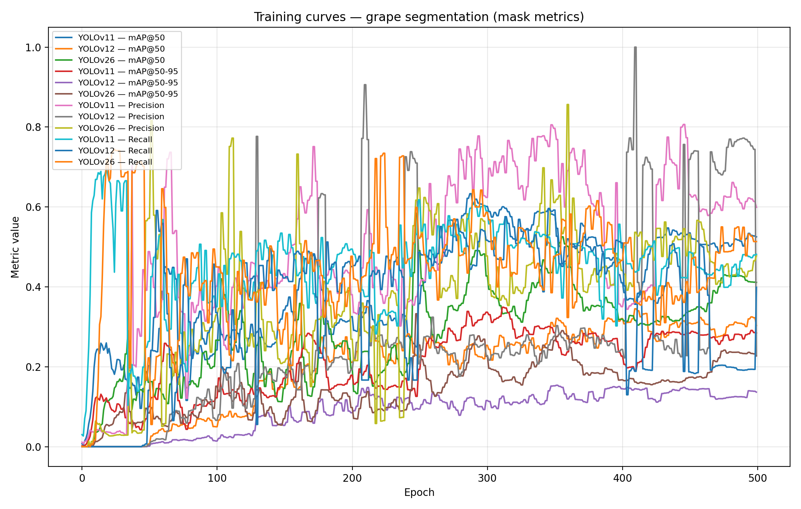

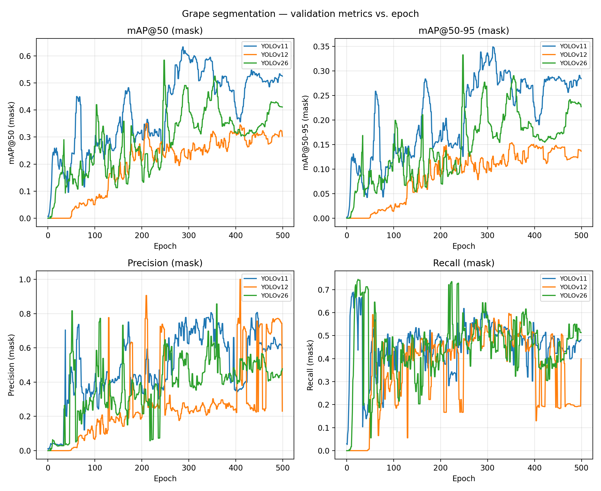

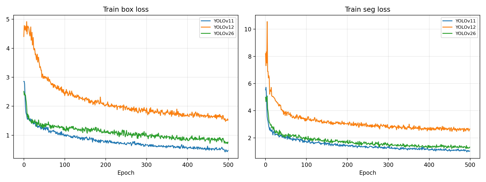

### 📊 Performance Charts

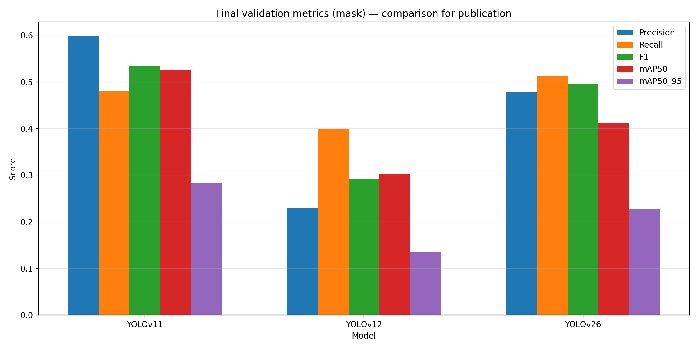

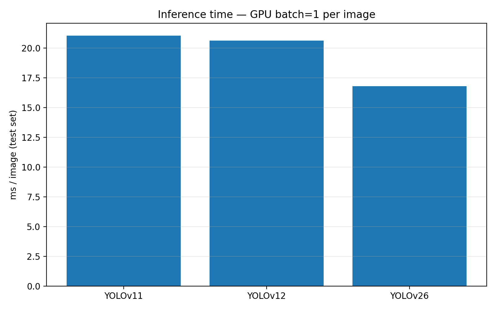

### 🖼️ Qualitative Results

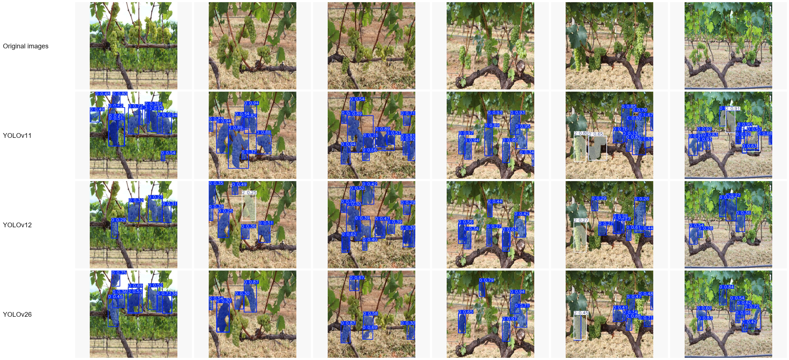

### 🔍 Sample Predictions

**YOLOv11**

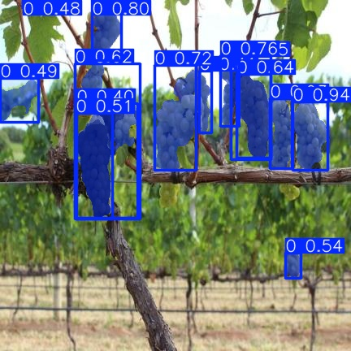
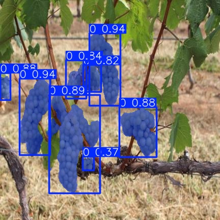

**YOLOv12**

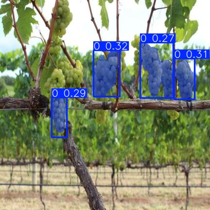
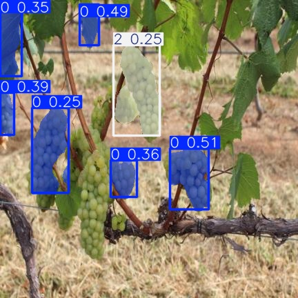

**YOLOv26**

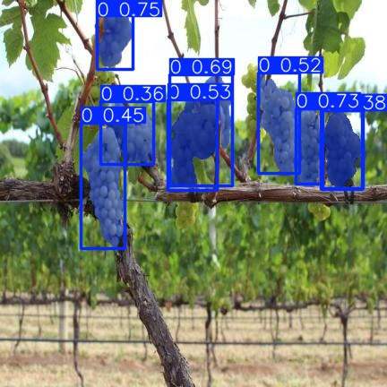
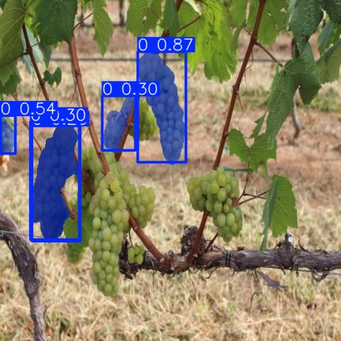

---

## 🚀 Current Status

* Model training completed
* Evaluation completed
* Research paper finalized

---

## 🔮 Future Scope

* Use larger and more diverse datasets
* Optimize models for real-time deployment
* Integrate with smart farming systems (drones/robots)

---

## 📄 Paper & Presentation

* [Research Paper (PDF)](2211981212_LaxmiNarayan.pdf)
* [Presentation Slides (PPTX)](IOHE_External_PPT.pptx)

---

## 📚 References

* YOLO Research Papers
* Deep Learning in Agriculture
* Computer Vision for Fruit Detection

---

## 💡 Note

This project is developed for **academic and research purposes** in the domain of precision agriculture.
